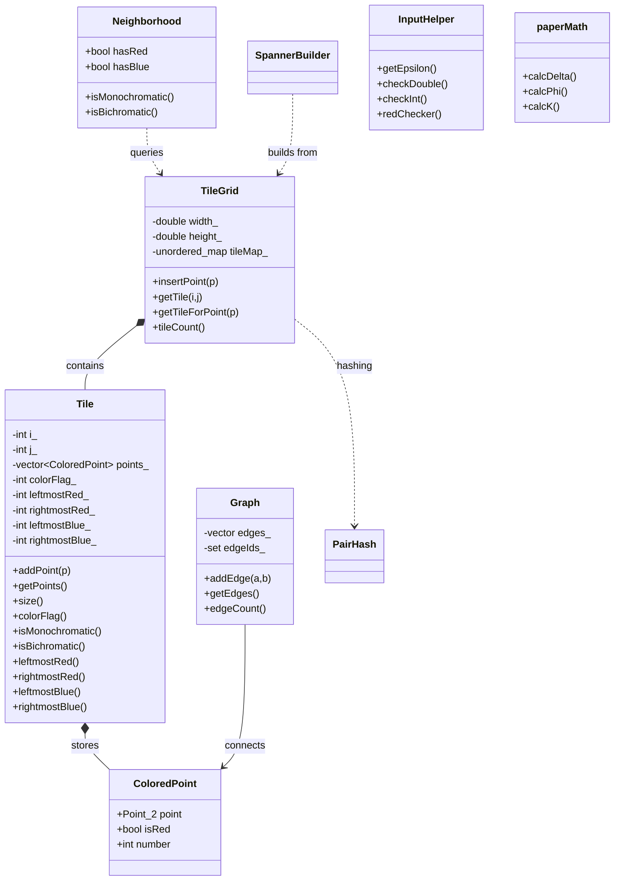

Implementation of an algorithm found in "Bichromatic Geometric Spanners"
by the Authors Theodore Fung, Csaba D. Tóth

Overview:
  This project implements the algorithm described in Bichromatic (3 + ε)-Spanners in the Plane. The implementation constructs a sparse geometric graph connecting red and blue points while approximating shortest-path distances by a stretch factor of 3+ε.
  
Theodore Fung, Csaba D. Tóth
"Bichromatic Geometric Spanners"
https://arxiv.org/abs/2607.10062

Features:
  - Recieves epsilon from the user
  - Gets points from the user(x,y, and color)
  - Calculates the delta described in the article
  - Creates a grid based on the delta described in the article
  - For each point, calulate i and j for the tile, if such a tile has already been created add the point to that tile, otherwise create a new tile.
  - There is a collection of tiles held within an unordered_tree, Key is (i, j) and the value is the tile itself with the collection of points within it
  - created a test to check the functionality of the tiles and tile flags/grid in general

UML Class Diagram:

Work in Progress:
  - creating logic for the four cases described in the article
  - create a user interface that shows the user all of the edges taken using the algorithm
  - create a way for the user to give large sets of points

Dependencies:
- C++20
- CGAL (for points)
- CMAKE

Acknowledgements:
This project was developed as part of a Summer 2026 Research Experiences for Undergraduates (REU) program at California State University, Northridge. The REU program is supported by the National Science Foundation (NSF).

I would like to thank Csaba D. Tóth and Theodore Fung, for their guidance throughout this project.
  
